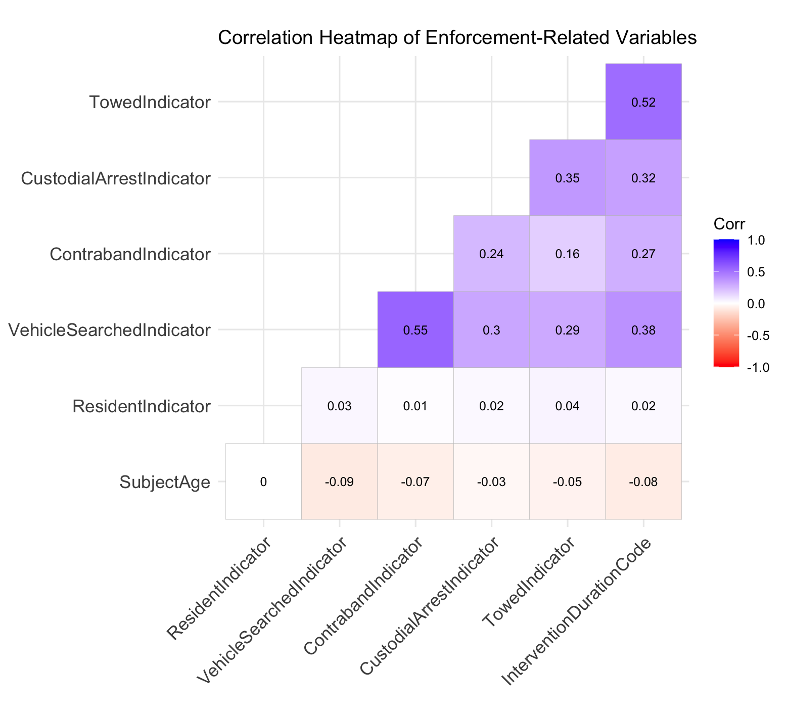
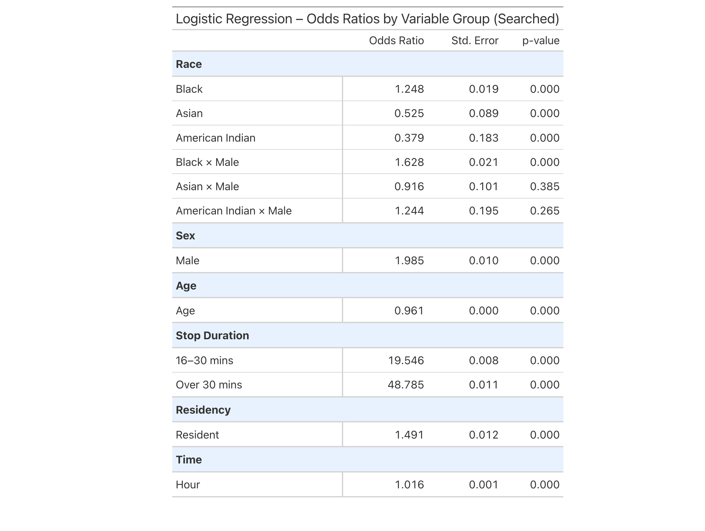
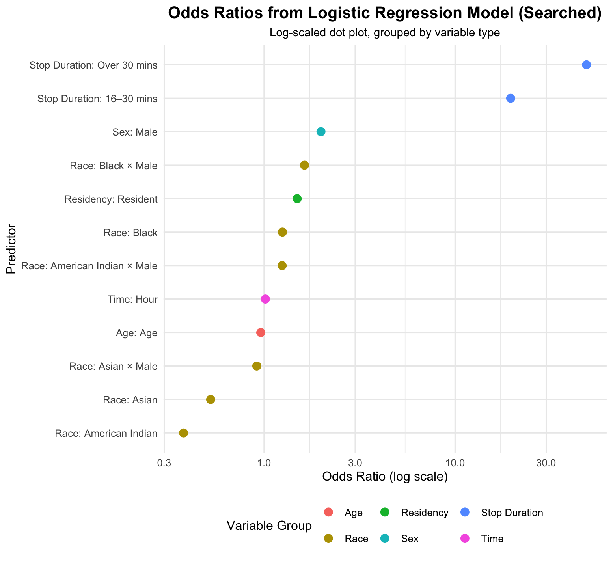
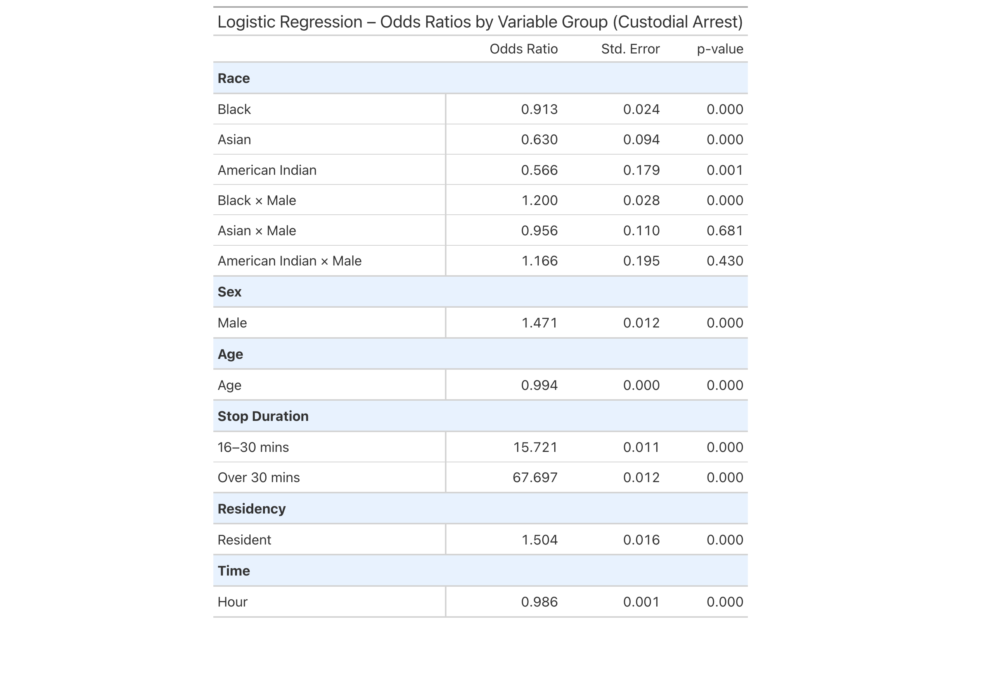
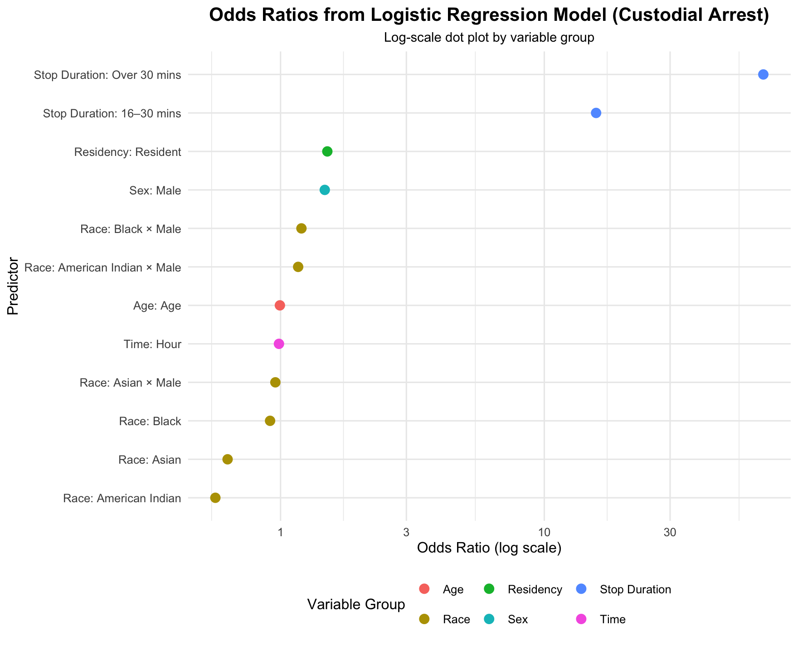

# Statistical Analysis of Enforcement Disparities in Connecticut Traffic Stops

## Introduction

In the context of growing attention to equity in law enforcement, the Connecticut Racial Profiling Prohibition Project provides a detailed dataset documenting traffic stops conducted by police departments across the state. Each record includes driver characteristics such as race, sex, and age, along with stop-level information such as the reason for the stop, whether the vehicle or person was searched, whether an arrest occurred, and contextual details like time and residency. The completeness and structure of this dataset offer a valuable opportunity to investigate potential disparities in enforcement outcomes.

This analysis focuses on two key outcomes observed during traffic stops:

- Whether the individual was placed under custodial arrest  
- Whether the individual or their vehicle was searched

To examine the relationship between demographic and contextual factors and these enforcement outcomes, logistic regression models are used. This modeling approach is appropriate for binary outcomes and provides interpretable estimates of how each predictor variable influences the likelihood of a specific event occurring.

The analysis also incorporates interaction terms, specifically Race × Sex. These terms allow the model to capture intersectional effects, revealing how the combination of demographic characteristics may influence outcomes differently than each characteristic considered independently. For example, the likelihood of arrest for Black male drivers may differ not only from White males or Black females but also from what would be expected by simply summing the separate effects of race and sex. These interaction terms help identify compound patterns that may otherwise go unnoticed.

## Motivation

The central question guiding this analysis is:  
**To what extent do demographic and situational factors affect the likelihood of being arrested or searched during a traffic stop?**

Three specific goals frame this investigation:

1. Investigate whether race and sex are associated with systematic differences in search and arrest rates.  
2. Explore the role of contextual variables, such as stop duration and residency, in predicting enforcement actions.  
3. Quantify the relative strength of these predictors using odds ratios from logistic regression.

By addressing these questions, the analysis aims to contribute to a more evidence-based understanding of potential disparities in traffic enforcement and to identify key variables that may inform future policy reforms or further academic inquiry.

# Modeling and Inference

## Predictor Selection and Model Design

The selection of predictors for the logistic regression models was guided by both domain knowledge and patterns observed in exploratory data analysis. Variables were chosen based on their conceptual relevance to law enforcement decision-making, as well as their availability and completeness in the dataset.

The following categories of predictors were included:

- **Demographic factors**: Race, sex, and age, which are commonly associated with disparities in policing outcomes.
- **Contextual and procedural factors**: Time of stop (Hour), residency status (Resident or not), and stop duration, which may influence officers’ perceptions of risk or justification for enforcement actions.
- **Interaction terms**: Interaction terms between race and sex were included to account for intersectional dynamics. For example, the experience of a Black male driver may differ in meaningful ways from those of a Black female or White male driver, and such effects may not be captured by main effects alone.

Transformations were kept minimal, as most variables were categorical or already on interpretable scales. Age was retained as a continuous variable to preserve information and model its linear association with the outcomes. Stop duration was discretized into meaningful intervals (e.g., under 15 minutes, 16–30 minutes, and over 30 minutes), which reflect plausible thresholds used in practice and help model nonlinear effects.

### Exploratory Analysis and Variable Relationships

Before constructing logistic regression models, a correlation heatmap was used to explore relationships among key enforcement-related variables. This step helps assess potential multicollinearity and provides structural context for how these variables may interact in later modeling. The variables included in the heatmap are vehicle searches, contraband discovery, custodial arrest, towing decisions, stop duration, subject age, and residency status. All variables were numerically encoded to enable Pearson correlation analysis.

As the heatmap illustrates, most variables exhibit weak to moderate pairwise correlations. This indicates a low risk of multicollinearity and supports the stability of regression estimates in the models that follow. One notable exception is the moderate correlation between vehicle searches and contraband discovery (r = 0.55), which is expected since contraband cannot be discovered without a prior search. Additionally, moderate positive correlations exist between towing and both searches (r = 0.38) and arrests (r = 0.32), suggesting that these enforcement outcomes may co-occur during stops that escalate in intensity.

Subject age shows weak negative correlations with most enforcement actions, implying that younger individuals may be more likely to experience intrusive outcomes such as searches or arrests. This trend reinforces the importance of including age as a continuous predictor in the model, as even small effects can compound across population-level analysis.

It is important to note that the correlation heatmap does not include all predictors used in the regression models. Categorical variables such as race and sex were excluded from this step due to their non-numeric nature. As a result, the heatmap provides only a partial view of variable relationships and should be interpreted as a structural diagnostic rather than a comprehensive model preview.

## Logistic Regression: Being Searched

To investigate disparities in traffic enforcement, a logistic regression model was used to estimate how individual and contextual factors influence the likelihood of being searched during a traffic stop. Logistic regression is well-suited to this binary outcome and allows for the interpretation of estimated odds ratios while controlling for other variables.

The model includes demographic variables (race, sex, age), contextual variables (stop duration, time, residency), and interaction terms such as Race × Sex, which help identify compound effects that may not be visible when considering each variable independently.

The results below summarize the estimated odds ratios (OR), standard errors (SE), and p-values for each predictor:

The table highlights several key findings. Male drivers are nearly twice as likely to be searched as female drivers (OR = 1.985, SE = 0.010, p < 0.001), and Black drivers have higher odds of being searched compared to White drivers (OR = 1.248). Conversely, Asian (OR = 0.525) and American Indian drivers (OR = 0.379) are significantly less likely to be searched. These effects are statistically robust.

Notably, the interaction term **Black × Male** is also significant (OR = 1.628, p = 0.004), suggesting that this group faces elevated search risk beyond the additive effects of race and gender. Other interactions such as **Asian × Male** and **American Indian × Male** are not significant, implying greater uncertainty around subgroup-specific disparities in those cases.

Among contextual factors, **stop duration** stands out as the strongest predictor. Stops lasting 16–30 minutes or more than 30 minutes are associated with dramatically higher odds of search (OR = 19.546 and OR = 48.785, respectively). These findings suggest that prolonged stops may indicate escalating suspicion, strongly tied to search decisions.

Age shows a small but statistically significant negative effect (OR = 0.961), indicating that younger drivers are more likely to be searched. Residency also has a moderate influence: town residents are more likely to be searched (OR = 1.491), suggesting that being local does not reduce enforcement exposure.

To visualize the relative strength of these predictors, a dot plot below presents the odds ratios on a log scale:

> **Note:** OR = 1 indicates no difference from the baseline group.

The plot confirms the dominant effect of stop duration, while also emphasizing the substantial roles of gender and intersectional identity. Visual grouping by variable type helps highlight the distinction between demographic and procedural factors, reinforcing the interpretation drawn from the table.

## Logistic Regression: Custodial Arrest

A second logistic regression model was constructed to estimate the likelihood of custodial arrest during a traffic stop, using the same predictors as in the search model. These include race, sex, age, residency status, time of stop, stop duration, and interaction terms between race and sex.

The results once again identify **stop duration** as the strongest procedural factor. Stops lasting 16–30 minutes have an odds ratio of 15.72, and those lasting more than 30 minutes reach 67.70. These extremely high values suggest that longer stops are highly predictive of arrest, potentially indicating escalation during the encounter.

**Sex** is also a significant factor—male drivers are approximately 47% more likely to be arrested than female drivers (OR = 1.471, p < 0.001). **Age** has a modest but significant negative effect (OR = 0.994), suggesting that younger drivers are more likely to be taken into custody.

With respect to **race**, the model estimates that Black (OR = 0.913), Asian (OR = 0.630), and American Indian (OR = 0.566) drivers are less likely to be arrested than White drivers, with all effects statistically significant at the 0.001 level. While this pattern appears contrary to raw outcome rates observed in exploratory plots, it reflects adjusted effects after controlling for other variables.

The **Black × Male** interaction term is notable (OR = 1.200), suggesting an increased risk for this subgroup that exceeds the additive contributions of race and sex. In contrast, interaction terms like Asian × Male and American Indian × Male are not statistically significant, indicating higher uncertainty or limited differential treatment for those groups.

To visualize the magnitude of effects, a log-scaled dot plot of the odds ratios is presented below:

> **Note:** OR = 1 indicates no difference from the baseline group.

This plot highlights the overwhelming influence of stop duration, as well as the consistent effects of sex and age. While race-based disparities are subtler in the arrest model compared to the search model, interaction terms reveal key intersectional differences that merit closer attention.

## Model Choice Justification

Linear regression models, such as multiple linear regression, aren't suitable for this analysis because the outcome variables (being searched or arrested) are binary rather than continuous. Logistic regression is the appropriate modeling framework for estimating probabilities of binary outcomes and interpreting relationships through odds ratios, which provide more meaningful and interpretable estimates in this context.

# Flaws and Limitations

Despite the use of logistic regression models and a large, state-level dataset, several limitations must be considered when interpreting the results of this analysis:

- **Omitted Variable Bias**  
  The model does not account for several potentially important variables. Information such as officer behavior, location-specific enforcement policies, the reason for search/arrest, or the driver’s prior history is unavailable in the dataset. This raises the possibility that some observed effects are actually proxies for unmeasured factors, which could distort estimates and lead to biased conclusions.

- **Data Quality and Inconsistencies**  
  The dataset is compiled by individual police departments across Connecticut, leading to inconsistent data entry practices. Errors due to manual entry, variation in coding standards, and missing or miscoded values may introduce noise into the analysis. These inconsistencies reduce the precision of certain variables and may weaken model reliability.

- **Sample Imbalance Across Demographic Groups**  
  Because Connecticut has a predominantly White population, subgroups such as American Indian and Asian drivers are underrepresented. This imbalance inflates the standard errors for these groups and makes it harder to detect statistically meaningful differences. As a result, conclusions about racial disparities, particularly from interaction terms, should be interpreted with caution.

- **Model Assumptions and Statistical Uncertainty**  
  Logistic regression assumes that the log-odds of the outcome are linearly related to the predictors, an assumption that may not fully hold in complex human behavior like policing. Furthermore, although many coefficients are statistically significant, others (particularly interaction terms) have large standard errors and p-values near conventional thresholds. This reflects uncertainty in some estimates and highlights the need for replication or additional data.

In light of these limitations, the results should be interpreted as evidence of associations not causal effects. Further research incorporating more detailed contextual and behavioral data would strengthen the ability to make confident inferences about disparities in traffic enforcement.

# Reflections on Modeling and Scope

The logistic regression models presented here offer an interpretable framework to examine how both demographic and situational characteristics influence search and arrest outcomes during traffic stops. By estimating the odds associated with each predictor, the models provide a structured way to assess the relationship between driver attributes, stop context, and law enforcement actions. Although the models are limited by the available data and assumptions, the results contribute to a more informed understanding of patterns in policing and help clarify which variables most strongly align with enforcement decisions. These insights build directly on the central question of the analysis by quantifying disparities across groups and evaluating how procedural and demographic factors interact.