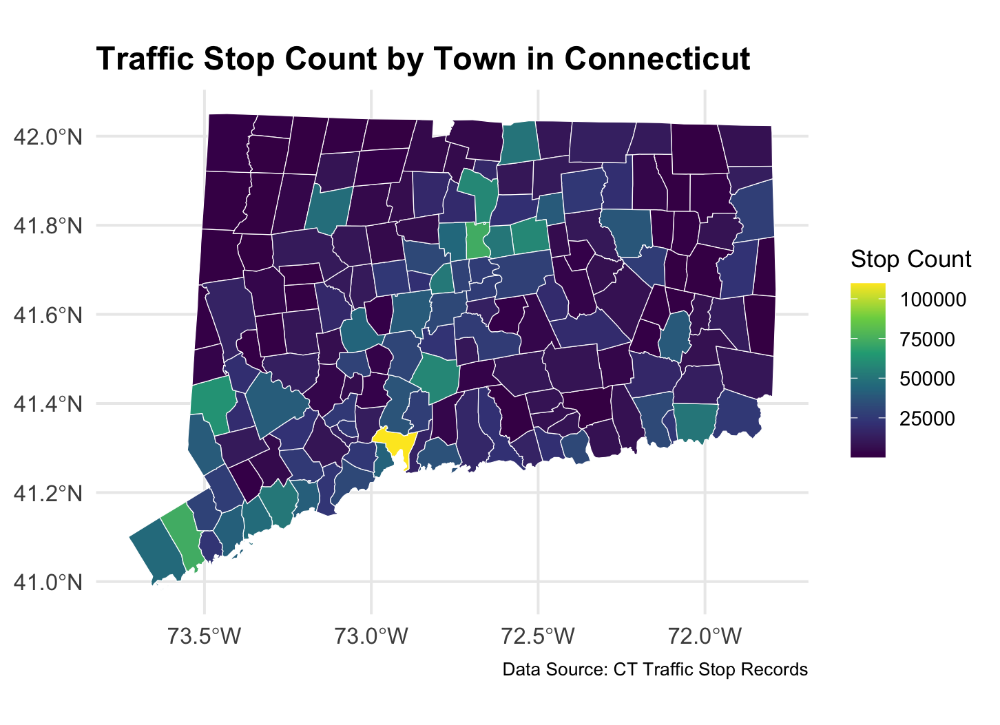
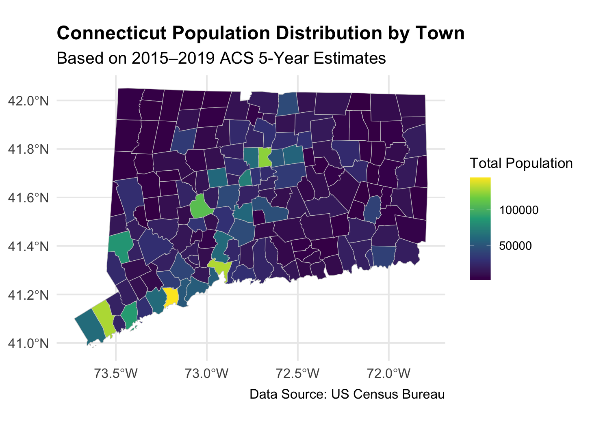
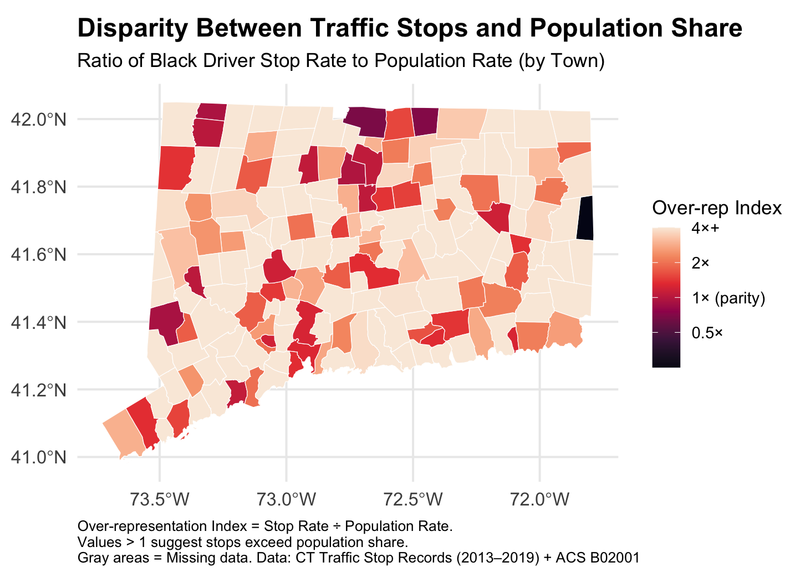

---

Between 2013 and 2019, police officers across Connecticut recorded more than three million traffic stops. Each stop may seem like a small event, but together they form a large and detailed record of how traffic laws are enforced across the state. By combining this enforcement data with U.S. Census population estimates, we can begin to examine how often different racial groups are stopped, and whether those patterns vary from town to town. It’s like trying to compare how busy two restaurants are, you can’t just count customers; you also need to know how many people live nearby.

This page presents the results of that analysis and highlights where disparities may exist in how drivers are treated on the road. While the data includes drivers of all racial backgrounds, particular attention is given to stops involving Black drivers, whose stop rates often appear elevated when compared to their share of the local population.

## Thesis Statement

While traffic stops are a routine part of law enforcement, they are not distributed evenly across populations. In Connecticut, Black drivers are often stopped at rates that exceed their share of the local population, and these disparities vary widely from town to town. By combining traffic stop records with census data, we can uncover geographic patterns that raise important questions about fairness on the road. To help explore these trends further, this page also includes an interactive dashboard that allows users to examine stop outcomes across race, age, gender, department, and time.

# Where Are the Most Traffic Stops Happening?

To understand the scale and distribution of traffic stops across the state, we began by mapping the total number of stops recorded in each Connecticut town between 2013 and 2019. This count helps highlight which areas experience the most traffic enforcement activity. Not surprisingly, large cities like Hartford, New Haven, and Bridgeport appear with the highest counts. However, several smaller or mid-sized towns also stand out, showing unexpectedly high numbers of stops relative to their size.

While this map offers a useful overview, raw stop counts can be misleading when viewed in isolation. Towns with more residents or greater traffic flow are likely to have more stops simply due to their size. This means that high stop totals do not necessarily indicate unusual enforcement patterns. To uncover whether some towns might be stopping drivers at unusually high rates, we needed to bring in population data and adjust for town size. That step helped reveal a much clearer picture of potential disparities in enforcement.

# Big Towns, More Stops? The Role of Population in Enforcement Patterns

As expected, the towns with the highest populations, such as Bridgeport, Stamford, and New Haven, also appeared prominently in the earlier stop count map. This suggests that many of the patterns in traffic stops can be explained by population size alone. In other words, towns with more residents naturally have more stops. The general alignment between the two maps supports the idea that enforcement activity tends to concentrate where more people live. However, aligning stop counts with population totals only gives part of the story. It does not yet tell us whether all racial groups are being stopped at rates proportional to their presence in the population.

# Twice as Likely to Be Stopped? Some Towns Say Yes

To go a step further, we created a metric called the Over-Representation Index, which compares the percentage of stops involving Black drivers to their percentage of the town’s population. A value of 1 means stops are proportional to population share, while values above 1 indicate potential overrepresentation. This index allows us to spot where disparities may exist even after adjusting for population size.

This map shows how the Over-Representation Index varies across Connecticut towns. While many places fall near parity, others show values well above 1, indicating that stops involving Black drivers occur at higher rates than their share of the local population. To prevent distortion from a small number of extreme values, the index is capped at 4. The visual pattern reveals that these disparities are not concentrated in just a few urban centers but appear in towns of varying sizes and locations, suggesting that overrepresentation is a broader pattern worth further attention.

# Are Stop Rates Proportional to Population Share?

To further investigate how closely stop rates align with local demographics, we plotted each town’s Black stop rate against its Black population share. Each point on the chart represents a town in Connecticut. The diagonal line marks perfect parity, where the share of stops involving Black drivers matches their share of the population.

Towns above the parity line indicate that Black drivers are stopped more frequently than expected based on their share of the population, while towns below suggest the opposite. The majority of towns fall above this line, and the upward-sloping trend suggests that these disparities are both widespread and systematic. In fact, over 60% of Connecticut towns show stop rates for Black drivers that exceed their population share, even after accounting for local demographics. Just as we wouldn’t judge a school’s performance by the number of students alone, we can’t assess enforcement fairness without considering who lives in each community.

# Exploring Traffic Enforcement Patterns Interactively

To supplement the static visualizations, an interactive dashboard was developed to examine traffic stop patterns across Connecticut by race, sex, age, stop reason, and police department. Built using R Shiny and hosted online, the tool enables customized exploration of outcomes such as arrest, search, and towing rates under different conditions and demographic groups.

The dashboard is structured around key themes: stop outcomes by day of the week, differences across stop reasons, enforcement patterns within specific police departments, and demographic breakdowns such as age distribution. For example, arrest rates can be compared across racial groups throughout the week, or search and towing rates can be examined in relation to specific departments or age brackets. These interactive components extend the insights presented in the static charts and offer additional context for understanding variability across towns and populations.

[Explore the interactive dashboard here](https://rxw06.shinyapps.io/ct_race_dashboard/)

---

# Key Findings

Across Connecticut, racial disparities in traffic enforcement are not confined to a few isolated areas. Towns with both large and small populations show patterns of disproportionate stops involving Black drivers. While major cities like Hartford and Bridgeport have high overall stop volumes, many smaller towns also exhibit elevated Over-Representation Index values. These geographic patterns suggest that racial disparities are not purely a product of urban density or traffic volume but are instead widespread and systematic. Even in towns with relatively small Black populations, stop rates for Black drivers frequently exceed parity, reinforcing the notion that structural differences in enforcement exist across the state.

In addition to geographic analysis, the interactive dashboard reveals disparities in specific enforcement outcomes. Across the week, Black drivers consistently face the highest arrest, search, and tow rates compared to other racial groups, with differences particularly pronounced on weekends. Investigative stops, those not directly tied to equipment issues or traffic violations, result in the highest arrest rates overall, but Black drivers also experience disproportionately high enforcement outcomes even during routine stops. Moreover, male drivers are more likely than female drivers to be arrested, searched, or towed across nearly every category. These interactive trends provide a deeper look into how race and gender intersect with enforcement decisions, highlighting consistent patterns that extend beyond location alone.

# Looking Ahead

Understanding where and how traffic stops occur across Connecticut provides valuable context for ongoing conversations around fairness and enforcement. While this analysis does not assign intent or blame, it highlights patterns that appear across towns and demographic groups. Tools like the interactive dashboard offer a starting point for deeper, more localized inquiry, whether by residents, researchers, or policymakers. As more data becomes available and public interest continues to grow, there are increasing opportunities to build systems that are both transparent and accountable.

