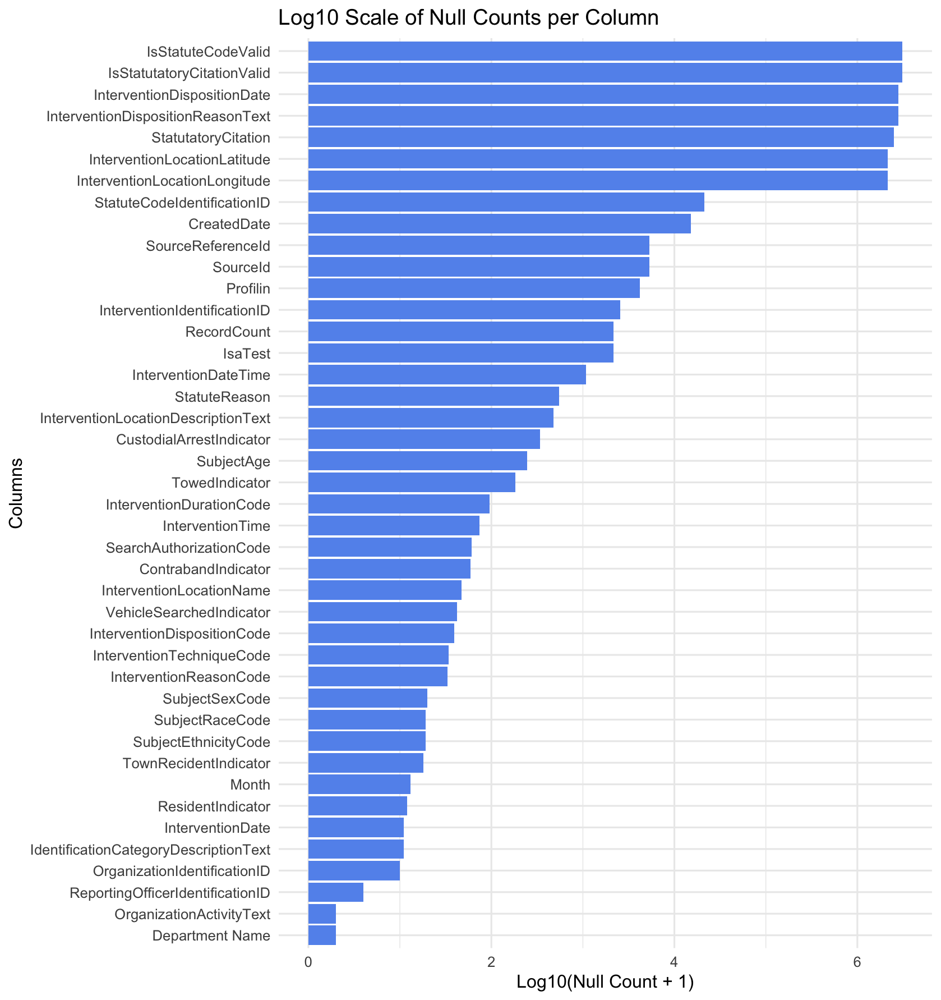
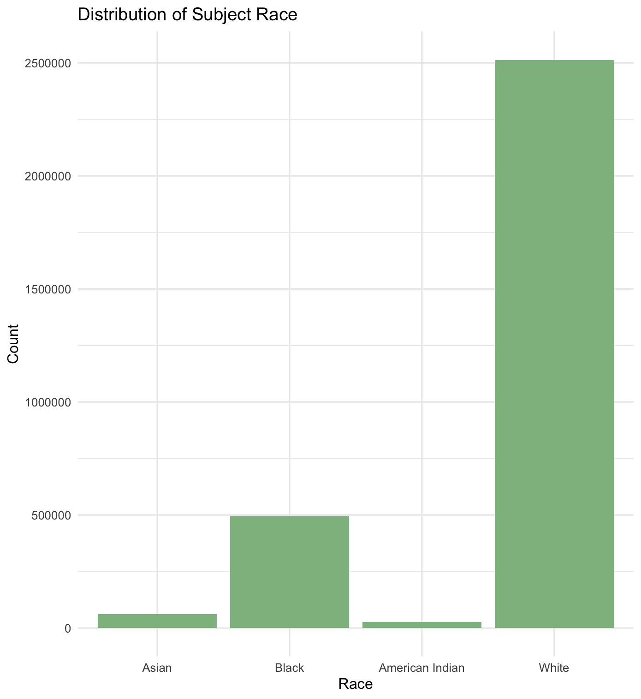
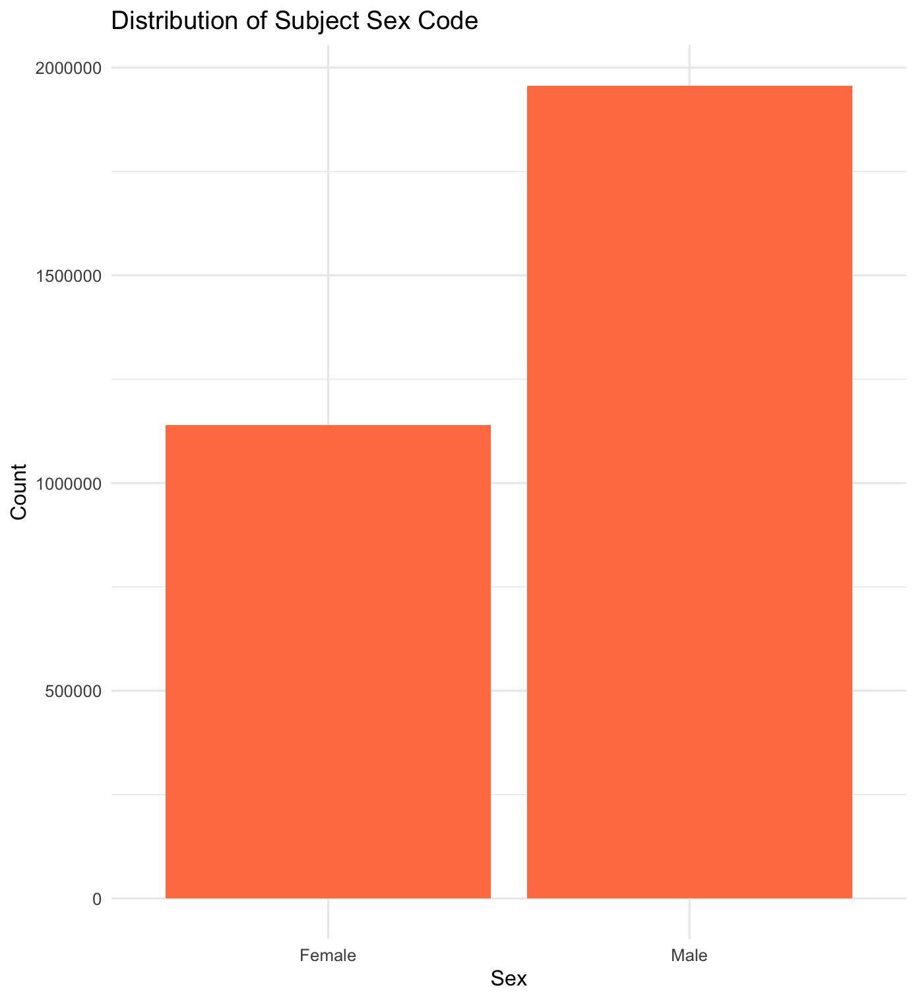
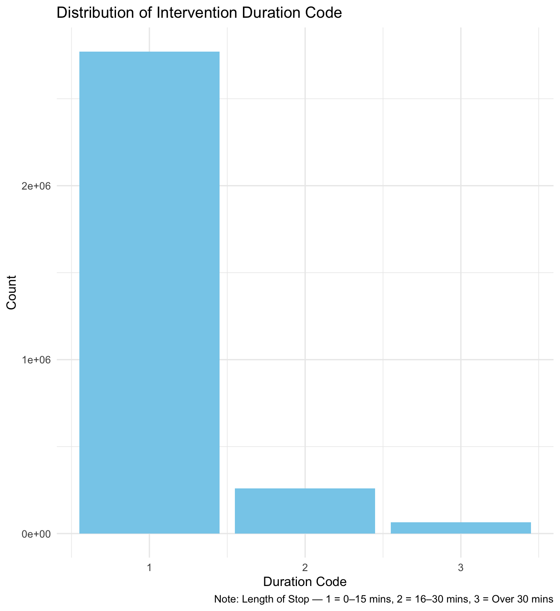
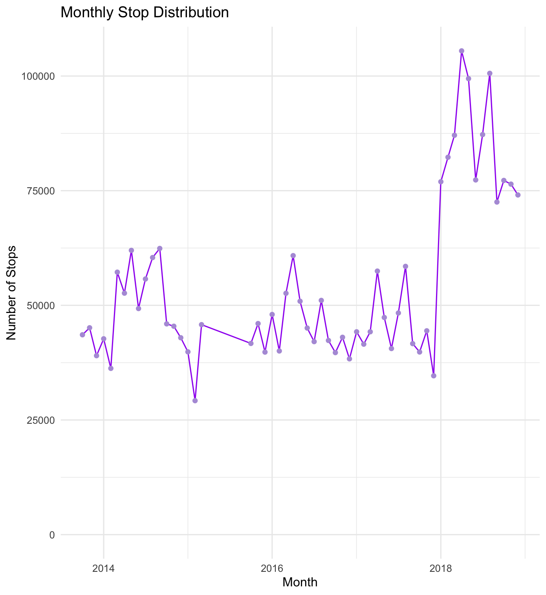
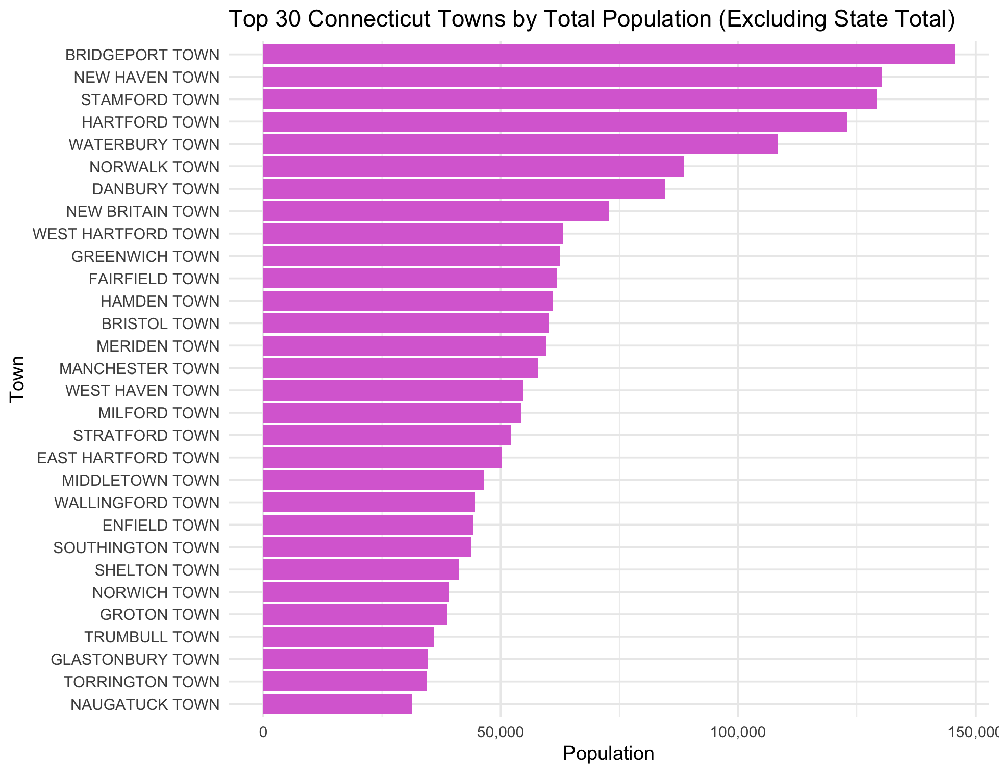

---
  

## Dataset 1: Traffic Stops - Racial Profiling Prohibition Project (Connecticut)

- This traffic stop data can be accessed via the [Connecticut Open Data Portal](https://data.ct.gov/Public-Safety/Traffic-Stops-Racial-Profiling-Prohibition-Project/nahi-zqrt/about_data), where it is made publicly available for transparency and accountability purposes.

- Information was submitted by police departments across Connecticut, then organized and published by the Connecticut Racial Profiling Prohibition Project (CTRP3), under the direction of the Institute for Municipal and Regional Policy at Central Connecticut State University.

- The collection of this data was required by state law (Public Act 12-74 and amended by Public Act 13-75), with the goal of monitoring police traffic enforcement practices and preventing racial profiling. Law enforcement agencies must report every traffic stop, along with key contextual and demographic information.

- Temporal coverage spans from 2013 to 2019, allowing for year-over-year comparisons and long-term analysis of enforcement patterns and policy outcomes over a seven-year period.


- Covering over 3.1 million individual stops, this dataset includes the date, time, and location of each stop, the driver's race, ethnicity, age, and gender, the reason for the stop, and the outcome—such as whether a warning, citation, search, or arrest occurred. Because of its depth and scope, the dataset has been used to evaluate racial disparities, guide police training reforms, and support statewide equity reviews in traffic enforcement.

---

### Data Files and Key Variables

This project draws on two key datasets: (1) traffic stop records collected across Connecticut between 2013 and 2019, and (2) population-level demographic estimates from the American Community Survey (ACS) 5-Year Estimates (2015–2019). To reduce complexity and focus on the most informative attributes, we selected 22 relevant variables from the traffic stop data based on completeness and analytical value.

#### Selected Variables from Traffic Stop Dataset

**Driver Demographics**

| Variable               | Description                                                  |
|------------------------|--------------------------------------------------------------|
| SubjectRaceCode        | Driver’s race (W=White, B=Black, A=Asian, I=American Indian) |
| SubjectEthnicityCode   | Driver’s ethnicity (H=Hispanic, N=Non-Hispanic, M=ME)        |
| SubjectSexCode         | Driver’s sex (M=Male, F=Female)                              |
| SubjectAge             | Driver’s age                                                 |
| ResidentIndicator      | Resident of Connecticut                                      |
| TownRecidentIndicator  | Resident of the town where stop occurred                     |

**Stop Context**

| Variable                    | Description                                                 |
|-----------------------------|-------------------------------------------------------------|
| InterventionDate            | Date of the stop                                            |
| InterventionDateTime        | Full timestamp of the stop                                  |
| Month                       | Month when the stop occurred                                |
| InterventionLocationName    | Town where the stop occurred                                |
| OrganizationIdentificationID| Unique code for reporting department                        |
| Department Name             | Name of the police department                               |

**Stop Reason and Method**

| Variable                  | Description                                                  |
|---------------------------|--------------------------------------------------------------|
| InterventionReasonCode    | Reason for stop (E=Equipment, I=Investigative, V=Violation)  |
| StatuteReason             | Legal basis/statute cited                                    |
| InterventionTechniqueCode | Stop method used (B=Blind, G=General, S=Spot)                |
| InterventionDurationCode  | Length of Stop: 1=0-15 Mins, 2=16-30 Mins, 3=Over 30 Mins  |

**Outcomes and Enforcement**

| Variable                    | Description                                                  |
|-----------------------------|--------------------------------------------------------------|
| InterventionDispositionCode | Outcome of stop (Warning, Infraction, Arrest, etc.)         |
| TowedIndicator              | Whether the vehicle was towed                                |
| VehicleSearchedIndicator    | Whether the vehicle was searched                             |
| SearchAuthorizationCode     | Legal basis for the search                                   |
| ContrabandIndicator         | Whether contraband was found                                 |
| CustodialArrestIndicator    | Whether a custodial arrest was made                          |
We selected these fields based on data completeness and relevance to our analysis of racial disparities, policing practices, and enforcement outcomes.

#### Null Value Distribution by Column

The following chart shows the number of null values in each column on a log scale, highlighting which fields had the most missing data. Fields with fewer nulls were prioritized in the final dataset.



#### Subject Race Distribution

This chart shows how many drivers of different races were stopped. The majority of stops involved white drivers, but the proportion of stops involving Black and other non-white drivers raises critical questions for further analysis.



#### Subject Sex Distribution

We also examined the gender breakdown of drivers. As shown below, a significantly higher number of stops involved male drivers compared to female drivers. This may reflect broader driving patterns, law enforcement discretion, or possible gender-based behavioral assumptions.



#### Duration of Traffic Stops

The majority of traffic stops lasted 15 minutes or less, as indicated by the dominance of code “1” in the chart below. Only a small fraction of stops extended beyond 30 minutes. This variable helps contextualize the scope of the stop and may reflect the intrusiveness or intensity of the enforcement action.

  

#### Monthly Traffic Stop Trends

To understand how stop frequency changes over time, we plotted the total number of stops each month from 2013 to 2019. The line chart below shows both seasonal patterns and structural shifts in policing activity.




### Data Cleaning Process

We cleaned the raw traffic stop data using a custom R script, which is available here:  
[`cleaning script`](https://github.com/sussmanbu/ma4615-sp25-final-project-team13/blob/main/scripts/clean_data.R)  

The original dataset included over 40 variables and more than 3 million rows. Many fields contained large proportions of missing or unusable values, so the first step was to identify and remove columns with a high percentage of nulls.

We used `tidyverse` (especially `dplyr`, `ggplot2`, `purrr`) and `here` for reproducible path management. These packages were essential for selecting, transforming, and visualizing the data throughout our pipeline.

#### Main Cleaning Steps

- **Missing value analysis**: We calculated the number and percentage of `NA` values in each column and removed columns with more than 50% missing values.
- **Column selection**: Retained 22 columns based on their analytical relevance and data completeness.
- **Data filtering**: Used `na.omit()` to drop rows with missing values in selected columns.
- **Factor and text cleaning**:  
  - Corrected inconsistent capitalization (`"m"` → `"M"` in `SubjectEthnicityCode`)  
  - Replaced unclear codes like `"no"` with `NA` in `InterventionReasonCode`  
  - Standardized `"R"` to logical `TRUE` in `TownRecidentIndicator`

#### Variable Recoding

Several binary columns (e.g., `ContrabandIndicator`, `TowedIndicator`) were originally stored as `"1"/"0"` or `"TRUE"/"FALSE"` strings. These were recoded to proper logical `TRUE`/`FALSE` values using a custom function:

```r
to_logical <- function(x) {
  if (is.character(x) || is.factor(x)) {
    x <- as.character(x)
    case_when(
      x %in% c("1", "TRUE") ~ TRUE,
      x %in% c("0", "FALSE") ~ FALSE,
      TRUE ~ NA
    )
  } else {
    x  
  }
}
```

We applied this transformation to the following fields:

```r
clean_data <- clean_data |>
  mutate(
    ContrabandIndicator = to_logical(ContrabandIndicator),
    VehicleSearchedIndicator = to_logical(VehicleSearchedIndicator),
    TownRecidentIndicator = to_logical(TownRecidentIndicator),
    ResidentIndicator = to_logical(ResidentIndicator),
    TowedIndicator = to_logical(TowedIndicator),
    CustodialArrestIndicator = to_logical(CustodialArrestIndicator)
  )
```

Time Parsing

To ensure consistency in time-based analysis, the InterventionDateTime field was converted into proper POSIXct datetime format:

```r
clean_data$InterventionDateTime <- as.POSIXct(
  clean_data$InterventionDateTime,
  format = "%m/%d/%Y %I:%M:%S %p"
)
```

### Additional Data Cleaning and Integration with ACS

Beyond cleaning the traffic stop records, we performed substantial processing to join the stop-level data with demographic information from the **American Community Survey (ACS) 5-Year Estimates (2015–2019)**. This step was essential for calculating population-adjusted stop rates and identifying overrepresentation patterns in law enforcement practices.

#### Standardizing Town Names

Many entries in the `InterventionLocationName` field included neighborhood names, misspellings, or non-town labels (e.g., "STORRS", "SCHOOL", or even street names). These needed to be cleaned and matched to the **official Connecticut town names** used in the ACS shapefiles.

- We converted all town names to uppercase and removed punctuation.
- A hand-coded alias map was created to convert common neighborhood labels to their corresponding town names. For example:
  - `"STORRS"` → `"MANSFIELD"`
  - `"COS COB"` → `"GREENWICH"`
  - `"WILLIMANTIC"` → `"WINDHAM"`
- After alias replacement, unmatched towns were removed from analysis.

```r
clean_data <- clean_data |>
  left_join(alias_map, by = c("TownMatched" = "from"))|>
  mutate(
    TownMatched = if_else(!is.na(to), to, TownMatched)
  )
```
## Dataset 2: American Community Survey (ACS) 5-Year Estimates (2015–2019) - Connecticut

- This dataset was downloaded from [data.census.gov](https://data.census.gov), the official platform of the U.S. Census Bureau. It provides free public access to nationwide demographic, economic, and housing data. The specific dataset used here is the ACS 5-Year Estimates (2015–2019) for the state of Connecticut. It can be found by navigating to “Advanced Search,” selecting “Connecticut,” and choosing the “2015–2019 ACS 5-Year Estimates Detailed Tables.”

- Collected by the U.S. Census Bureau through the American Community Survey, a continuous nationwide survey designed to provide detailed, up-to-date information between each decennial census. The ACS data helps communities plan for transportation, housing, emergency services, and economic development. It is widely used by local governments, federal agencies, nonprofits, and researchers for evidence-based decision making.

- The file includes population estimates for different racial and ethnic groups across the state and its towns. Columns are organized by population group (such as “White alone” or “Black or African American alone”) and geographic location. For each group and town, the file provides an estimate and a margin of error. Variable names follow a pattern like Town Name!!Estimate and Town Name!!Margin of Error, making it easy to interpret the data structure.

- This dataset is particularly useful for understanding how Connecticut’s population varies by race and ethnicity at the local level. It supports needs assessment, resource allocation, and social policy development by giving a consistent statistical view of communities across five years. This makes it a reliable tool for tracking trends, comparing towns, and identifying areas for targeted intervention.


### Data Files and Key Variables

The dataset contains town-level estimates of population counts by race and ethnicity. These estimates are used to provide population context for interpreting patterns in traffic stop data. Each column represents a specific demographic group, and each row corresponds to a race/ethnicity category (e.g., "Total", "White alone", "Black or African American alone", etc.).

#### Key Variables (Grouped and Explained)

We categorize the ACS variables into two groups based on what they describe: Total Population and Race-Specific Population.

---

**1. Total Population**

| Variable Name   | Description                                  |
|------------------|----------------------------------------------|
| `Total`          | Total population in each town (benchmark for all proportions) |

 This is the baseline used for computing per-capita metrics and racial proportions.

---

**2. Race-Specific Population**

These variables represent the number of people in each racial group, regardless of Hispanic ethnicity. They are mutually exclusive and sum to the total population.

| Variable                                | Description                                    |
|-----------------------------------------|------------------------------------------------|
| `White alone`                           | Number of people who identified as White only  |
| `Black or African American alone`       | Number of people who identified as Black only  |
| `American Indian and Alaska Native alone` | Number of people who identified as AI/AN only |
| `Asian alone`                           | Number of people who identified as Asian only  |
| `Native Hawaiian and Other Pacific Islander alone` | Pacific Islander population only       |
| `Some other race alone`                 | Individuals who selected “Some other race” only |
| `Two or more races`                     | People who selected more than one race         |

 These variables allow us to compute racial representation in the population and compare it to traffic stop data by race.
 
Thefollowing figure shows the Top 30 Connecticut Towns by Total Population, excluding the state-level aggregate. This provides a clear reference for how population is distributed geographically across the state:




### Cleaning the ACS Population Data

The ACS data provides racial population estimates per town in Connecticut. To prepare it for merging, we focused on the total population group and applied the following cleaning steps:

- Filtered rows where `Label (Grouping)` is "Total:" to isolate total population estimates.
- Selected only estimate columns, corresponding to towns.
- Reshaped the data from wide to long format so each row represents a town.
- Cleaned town names by removing artifacts like `"!!ESTIMATE"`, `", CONNECTICUT"`, `", CDP"`, `" TOWN"` and other suffixes.
- Converted population counts to numeric.
- Filtered only valid Connecticut towns, using shapefile-based town names via the `tigris` package.

```r
# Get valid towns from TIGRIS shapefile
valid_towns <- places(state = "CT", cb = TRUE) |>
  pull(NAME) |>
  str_to_upper()

# Clean and reshape ACS total population data
total_long <- race_raw |>
  filter(`Label (Grouping)` == "Total:") |>
  select(contains("!!Estimate")) |>
  pivot_longer(cols = everything(), names_to = "Town", values_to = "PopTotal") |>
  mutate(
    Town = str_to_upper(Town),
    Town = str_remove(Town, "!!ESTIMATE"),
    Town = str_remove(Town, ", CONNECTICUT"),
    Town = str_remove(Town, ",.*$"),
    Town = str_remove(Town, " TOWN"),
    Town = str_squish(Town),
    PopTotal = as.numeric(PopTotal)
  ) |>
  filter(Town %in% valid_towns)
```

The resulting `total_long` dataset contains the total population per valid Connecticut town, with names aligned to geographic shapefiles. This prepares it for merging with race-specific counts or traffic stop data.

## Combine Datasets
To analyze traffic stop rates across Connecticut towns, we combined summarized stop data with total population estimates from the ACS.


We first filtered out non-town entries using an official list of Connecticut towns (`ct_towns$NAME`) from TIGRIS shapefiles, and then grouped the data by town:

```r
stop_summary <- clean_data |>
  filter(TownMatched %in% ct_towns$NAME) |> 
  group_by(TownMatched) |>
  summarise(
    TotalStops = n(),
    BlackStops = sum(SubjectRaceCode == "B", na.rm = TRUE),
    .groups = "drop"
  )
```
This gives us one row per town with total stops and number of stops involving Black individuals.

We then ensured that town names in the population data matched the format of the stop data:

```r
total_long <- total_long |>
  mutate(
    Town = str_to_upper(Town),
    Town = str_remove_all(Town, '[[:punct:]]'),
    Town = str_squish(Town)
  )
```

Finally, we joined the two datasets using town names to produce a combined summary table:

```r
combined_summary <- stop_summary |>
  left_join(total_long, by = c("TownMatched" = "Town"))
```

This `combined_summary` dataset now includes, for each town:
- Total number of traffic stops
- Number of stops involving Black drivers
- Total population

It allows us to compute metrics such as per-capita stop rates and racial disproportionality indicators.


## Extra Library Used in Analysis

1. `broom`: Converts statistical model objects into tidy data frames for easier analysis and visualization.

2. `knitr`: Enables embedding R code and results into dynamic reports, supporting reproducible research.

3. `lubridate`: Simplifies the process of working with dates and times in data analysis.

4. `gt`: Creates presentation-ready tables, ideal for summarizing regression outputs and descriptive statistics.

5. `corrplot`: Visualizes correlation matrices using customizable and intuitive plots.

6. `tigris`: Downloads and handles US Census TIGER/Line shapefiles for spatial data analysis.

7. `sf`: Provides tools for handling and analyzing spatial vector data, essential for mapping and geographic modeling.

8. `stringr`: Offers consistent functions for string manipulation and regular expression matching.

9. `scales`: Assists in scaling and formatting axes and labels in plots, improving visual clarity.

10. `viridis`: Provides perceptually uniform color maps, especially useful for colorblind-friendly visualizations.