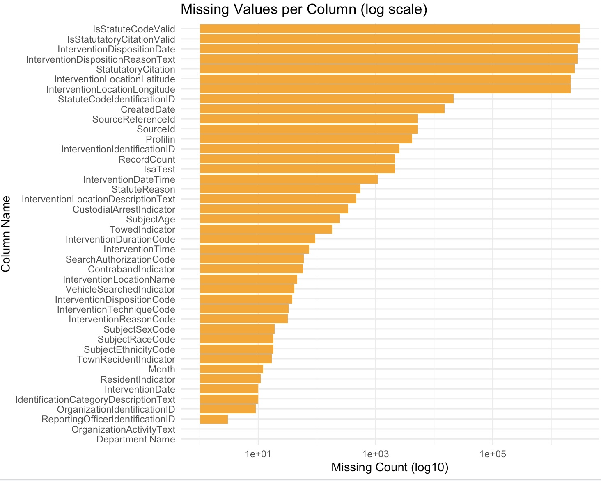
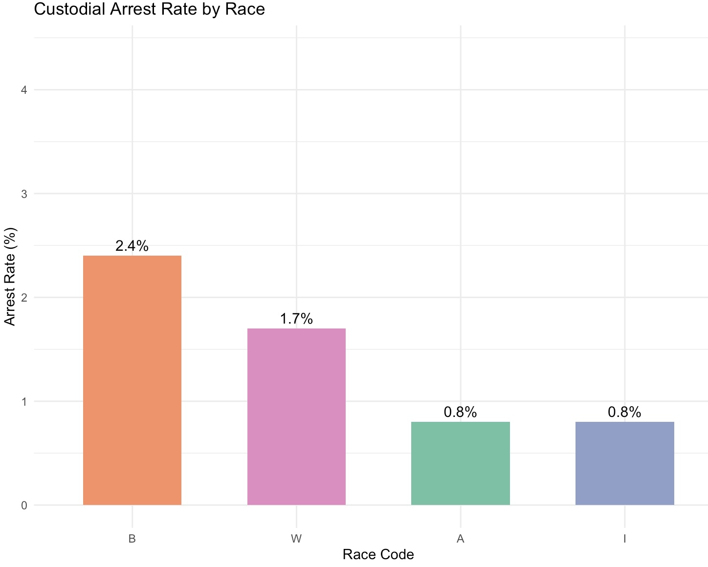

### Data Loading and Cleaning
Because the dataset is very large, we used the `vroom()` package to load the data efficiently. During this process, we noticed some problems with how certain columns were interpreted. Specifically, two columns (IsStatuteCodeValid and IsStatutatoryCitationValid) that actually contained timestamp strings were mistakenly read as logical values (`TRUE/FALSE`). This mismatch caused parsing errors, so we fixed it by manually setting those columns to character type during import using the `col_types` argument.

After the data was successfully loaded, we examined how much missing data existed in each column. We found that several columns contained mostly missing values. To visualize this, we created a bar chart showing the number of missing values in each column (**Figure 1**). Because some columns had such large amounts of missing data, we used a log scale on the x-axis to make differences across all columns easier to compare. Without the log scale, the missing values in other columns would have been almost invisible by comparison.

*Figure 1: Missing values per column (log scale)*

To simplify our analysis, we decided to focus on a subset of variables that had fewer missing values and were most relevant to our research goal: exploring racial disparities in traffic stops. These selected variables include demographic information (such as race, sex, and age), as well as stop outcomes like whether the vehicle was searched or the person was arrested. We dropped rows with missing values in these columns and saved the cleaned version of the dataset as `cleaned_dataset.rds`.

As part of our early analysis, we looked at custodial arrest rates by race. The bar chart in **Figure 2** shows that Black drivers (B) had the highest arrest rate at 2.4%, followed by White drivers (W) at 1.7%. Asian (A) and American Indian (I) drivers had the lowest arrest rates, both at 0.8%. This initial result points to a potential racial disparity in arrest outcomes that we plan to explore further.

*Figure 2: Custodial arrest rate by race*

> **Note:** Race codes — W = White, B = Black, A = Asian, I = American Indian.

### Data for Equity
To “Be Transparent and Accountable” should be a necessity in every project one approaches when working with data—especially when dealing with sensitive information about profiling of  individuals. We should approach this project by checking our assumptions and being mindful of our own perspectives, which may influence the outcome. When data cleaning, filtering, and analyzing, we should clearly document our methods and decisions. Especially when handling missing race and ethnicity data, deciding how we will categorize individuals, and examining time frames and geographic areas—we need to be deliberate and reflective about how these decisions affect the outcomes of the data we have access to. With data that involves historical and present-day inequities, we need to be alert and acknowledge that our decision-making at every step will impact the patterns we find and display.

Secondly, we need to “Protect Privacy and Prevent Harm.” As students in MA415 who have taken prerequisites in data science, math, or computer science, we can all agree that data is powerful. Knowing that data can be used to empower communities or optimize results, it is also known to be easily misused or manipulated to harm individuals and communities. This principle extends from the first—transparency—in that we must understand the broader context and avoid over-aggregating or simplifying towns, which may lead to misinterpretation without systemic analysis. In addition, we need to critically examine our findings and avoid letting our assumptions speak louder than the data itself. This helps prevent weaponizing communities, justifying over-policing, or discrediting valid complaints about profiling. Considering the limitations of data collection, racial profiling laws, and the historical discrimination present in traffic enforcement, we must not only analyze quantitative features but also reflect on qualitative context. Large disparities in outcomes do not automatically indicate clear-cut cases of discrimination; nuance is required.