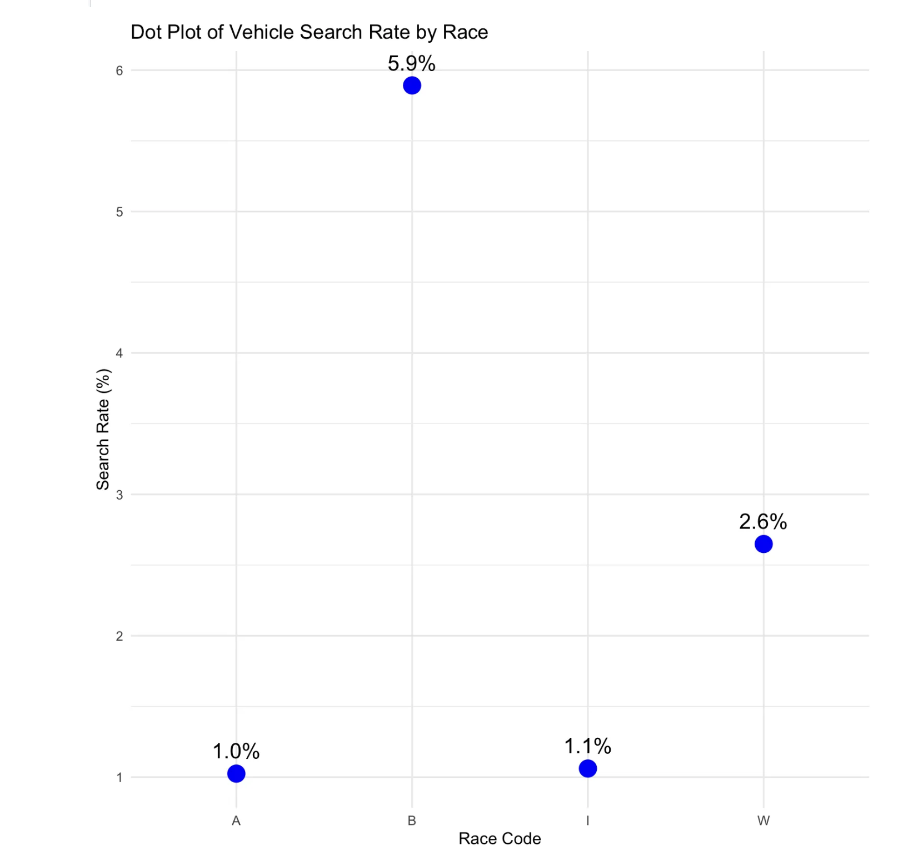
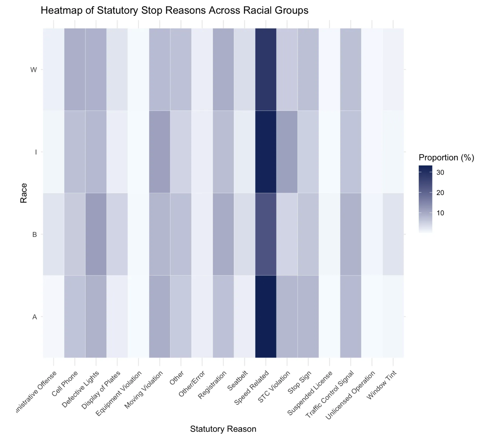
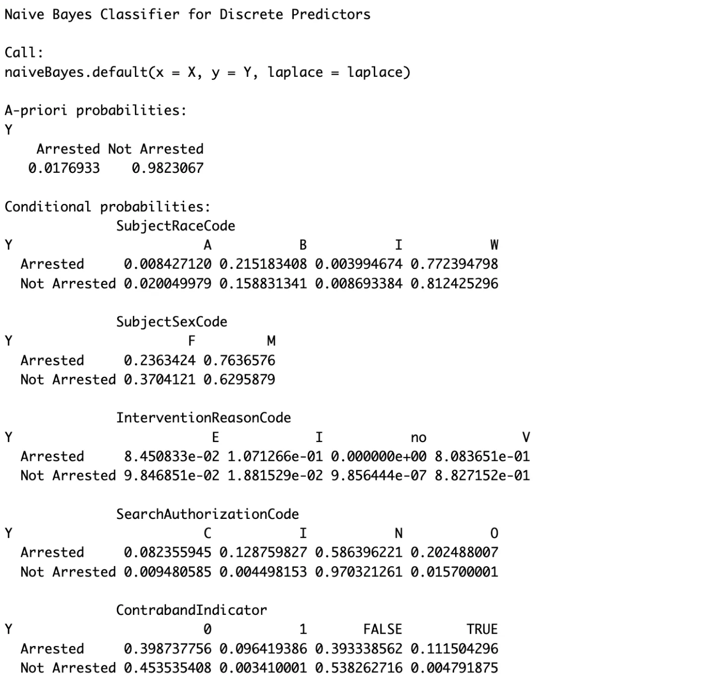

### Further Data Exploration and Analysis

In our previous analysis of custodial arrest rates by race, we found that Black drivers (B) had the highest arrest rate, suggesting a potential racial disparity. However, this raises the question of whether this trend is the most significant insight or if it conceals more complex relationships within the data. To explore this further, we plan to investigate how stop reasons, search decisions, and other factors differ across racial groups. By examining these interactions, we aim to determine whether the observed disparities can be explained by legitimate differences in stop circumstances or if they point to potential bias in law enforcement practices.

We have refined our analysis by creating a subset that focuses on key variables related to driver demographics, traffic stop reasons, search and arrest outcomes, and department-level information. This allows us to concentrate on the most relevant factors when investigating potential racial bias in traffic enforcement. Recognizing the sensitivity of missing values, especially in variables like race, gender, and enforcement actions, we carefully examined their distribution. Variables such as Department Name and InterventionDate have minimal missing values, while SubjectSexCode and SubjectRaceCode show slightly higher missing entries. Some variables, including CustodialArrestIndicator and SearchAuthorizationCode, have up to 339 missing entries. However, given the dataset’s size of approximately 3.1 million rows, removing rows with missing values will not significantly impact the sample size, ensuring sufficient data for reliable analysis. This decision also minimizes the risk of introducing artificial patterns through imputation. 

To gain a broader understanding of the dataset and the relationships between variables, we first considered the overall racial distribution.Notably, approximately 80% of the dataset consists of White drivers. After reviewing Connecticut’s racial demographics, we found that White individuals do make up a significant portion of the population, which may explain this distribution. This highlights the importance of focusing on proportions rather than raw counts in subsequent analyses to ensure fair comparisons across racial groups.

 
*Figure 1: Search Rate by Race*

Figure 1 presents the Search Rate by Race, showing that Black drivers (B) had the highest search rate at 5.9%, followed by White drivers (W) at 2.6%. In contrast, Asian (A) and American Indian (I) drivers experienced significantly lower search rates at around 1%. This disparity suggests a potential racial bias in search decisions.

*Figure 2: Heatmap of Statutory Stop Reasons Across Racial Groups*

Figure 2 displays the Heatmap of Statutory Stop Reasons Across Racial Groups, with proportions calculated as the percentage of each stop reason within its respective racial group. The heatmap shows that Speed-Related and Defective Lights are common reasons for traffic stops across all racial groups. At the same time, some stop reasons are used more frequently for certain groups than others, reflecting differences in the reasons drivers of different races are stopped.

### Initiating Model Exploration

This week, we started exploring the feasibility of using a Naive Bayes model to predict Custodial Arrest based on factors such as Race, Gender, Intervention Reason, Search Authorization, and Contraband Indicator. The initial model has been built, providing prior probabilities and conditional probabilities for each variable. In the next steps, we will further explore the suitability of different models for our dataset. Given the large dataset, the training process has been time-consuming, and we are considering additional models like Logistic Regression and Decision Trees for comparison. We will evaluate each model’s performance using appropriate metrics to determine its effectiveness.

