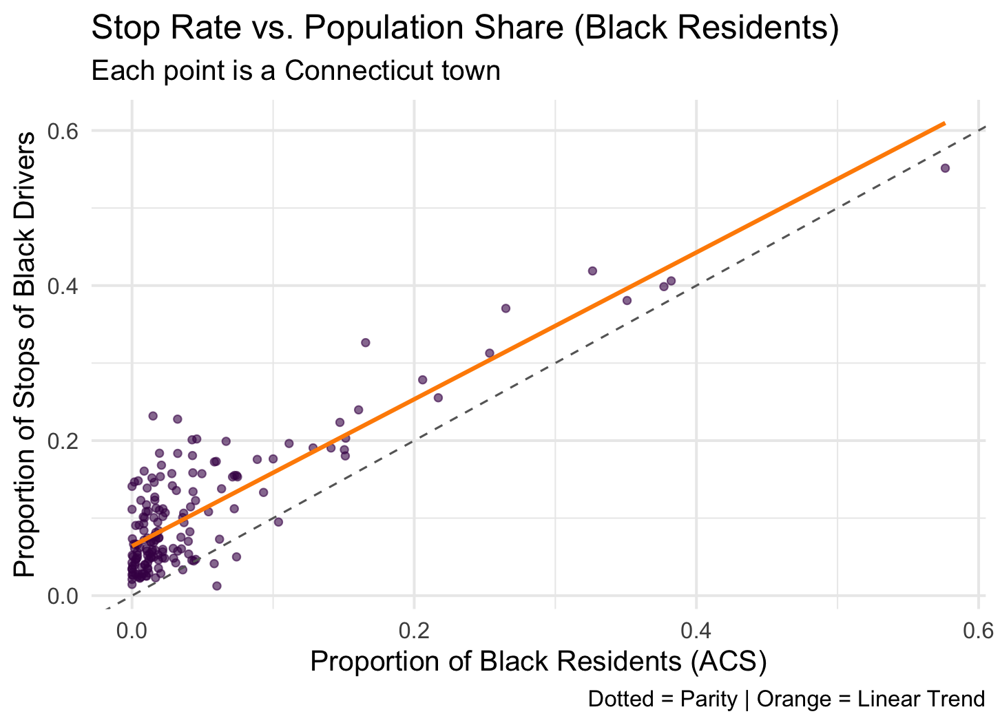

### Mapping Traffic Stop Data by Town in Connecticut

This week, we started visualizing traffic stop data geographically across Connecticut. Because the dataset contained a high proportion of missing values (around 70%) for latitude and longitude, we decided to use the `InterventionLocationName` field for town-level matching. However, these names were messy and inconsistent—some were neighborhoods, villages, or landmarks rather than official towns. We used the `tigris` package to load official town boundaries and mapped as many names as possible. For unmatched names, we hand-coded the top 20 most frequent ones to their correct town counterparts. This significantly improved the accuracy of our town-level stop counts, with the remaining unmatched values having negligible impact on the final results.

The first map shows the count of traffic stops by town. As expected, towns like New Haven, Hartford, and Bridgeport appear with the highest counts. However, this raw count map doesn’t account for differences in population across towns—it’s heavily influenced by town size and traffic volume. We noted that this map might be misleading if interpreted without considering population size.


### Mapping Population Distribution and Comparing to Stop Counts

To address population differences, we loaded American Community Survey (ACS) 5-Year Estimates from the U.S. Census Bureau (2015–2019). The second map visualizes population distribution across Connecticut towns using this data. As expected, the most populous towns such as Bridgeport, Stamford, and New Haven are highlighted in yellow-green, indicating populations over 100,000.

Comparing the first and second maps revealed a key insight: while towns like Bridgeport and Stamford have both high stop counts and high populations (which is expected), some smaller towns showed relatively high stop counts despite having modest population sizes. This suggested a need to standardize stop counts by population to reveal possible disparities, leading to our next step.


### Combining Traffic Stop Data with Demographics

Next, we merged the cleaned traffic stop data with population statistics. Specifically, we summarized the number of total traffic stops (TotalStops) and the number involving Black drivers (BlackStops) for each town. We then calculated the Black stop rate using the formula:
```r
StopRateBlack = BlackStops / TotalStops 
```
From the ACS dataset, we extracted each town’s total population (`PopTotal`) and Black population (`PopBlack`).  
This allowed us to calculate the Black population share using:

```r
PopRateBlack = PopBlack / PopTotal

```

With these values, we introduced a key disparity metric: the Over-Representation Index, calculated as:

```r
OverRepIndex = StopRateBlack / PopRateBlack
```
This index measures whether Black drivers are stopped at rates higher than their population share. Values greater than 1.0 suggest that Black drivers are stopped more frequently than expected based on their population share.


### Interpreting Disparity Maps and Scatterplots

The third map visualizes the Over-Representation Index across towns. We capped the index at 4× to avoid distortion by extreme outliers. Redder areas indicate towns where Black drivers are stopped at significantly higher rates than their population share. Many towns show an index above 2×, suggesting systemic disparities that merit further investigation.


The final scatterplot compares the proportion of stops involving Black drivers to the proportion of Black residents in each town. The dashed line indicates perfect parity, where stops match population share. However, most towns fall above this line, and the orange trend line confirms a positive bias—on average, Black drivers are stopped more frequently than expected based on their population share. This highlights a consistent pattern of overrepresentation across the state.



